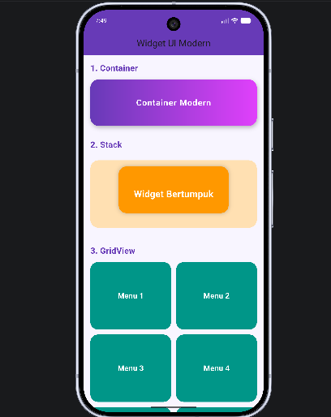
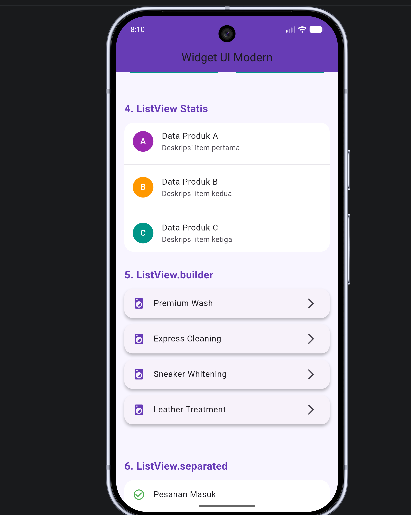
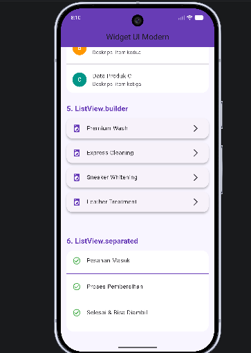

<div align="center">
  <br />

  <h1>LAPORAN PRAKTIKUM <br>
  APLIKASI BERBASIS PLATFORM
  </h1>

  <br />

  <h3>MODUL - 4 & 5<br>
    Antar Muka Pengguna
  </h3>

  <br />

  

  <br />
  <br />
  <br />

  <h3>Disusun Oleh :</h3>

  <p>
    <strong>Arvan Murbiyanto</strong><br>
    <strong>2311102074</strong><br>
    <strong>S1 IF-11-04</strong>
  </p>

  <br />

  <h3>Dosen Pengampu :</h3>

  <p>
    <strong>Cahyo Prihantoro, S.Kom., M.Eng.</strong>
  </p>
  
  <br />

  <h3>LABORATORIUM HIGH PERFORMANCE
  <br>FAKULTAS INFORMATIKA <br>UNIVERSITAS TELKOM PURWOKERTO <br>2026</h3>
</div>

<hr>

---

# 1. Tugas

📝 Tugas Praktikum Modul 4-5 Flutter

Buat 1 project Flutter yang menampilkan beberapa widget UI berikut:  
🔹 Yang harus ada:  
Container → kotak berwarna  
GridView → minimal 6 item (grid)  
ListView → 3 item (A, B, C)  
ListView.builder → list dari data array  
ListView.separated → list + garis pembatas  
Stack → tampilan bertumpuk (kotak / text)

📦 Output yang dikumpulkan:
Screenshot hasilnya
Source code
Penjelasan singkat tiap widget

---

# 2. Source Code main.dart

```dart
import 'package:flutter/material.dart';

void main() {
  runApp(const PraktikumModulApp());
}

class PraktikumModulApp extends StatelessWidget {
  const PraktikumModulApp({super.key});

  @override
  Widget build(BuildContext context) {
    return MaterialApp(
      title: 'Tugas Praktikum 4-5',
      debugShowCheckedModeBanner: false,
      theme: ThemeData(
        primarySwatch: Colors.deepPurple,
        scaffoldBackgroundColor: const Color(0xFFF8F5FF),
        fontFamily: 'Roboto',
      ),
      home: const TugasScreen(),
    );
  }
}

class TugasScreen extends StatelessWidget {
  const TugasScreen({super.key});

  final List<String> arrayLayanan = const [
    "Premium Wash",
    "Express Cleaning",
    "Sneaker Whitening",
    "Leather Treatment"
  ];

  final List<String> arrayStatus = const [
    "Pesanan Masuk",
    "Proses Pembersihan",
    "Selesai & Bisa Diambil"
  ];

  @override
  Widget build(BuildContext context) {
    return Scaffold(
      appBar: AppBar(
        title: const Text("Widget UI Modern"),
        centerTitle: true,
        elevation: 0,
        backgroundColor: Colors.deepPurple,
      ),

      body: SingleChildScrollView(
        padding: const EdgeInsets.all(16),
        child: Column(
          crossAxisAlignment: CrossAxisAlignment.start,
          children: [

            // ==========================================
            // 1. CONTAINER
            // ==========================================
            const JudulSection(judul: "1. Container"),
            Container(
              height: 110,
              width: double.infinity,
              decoration: BoxDecoration(
                gradient: const LinearGradient(
                  colors: [
                    Colors.deepPurple,
                    Colors.purpleAccent,
                  ],
                ),
                borderRadius: BorderRadius.circular(20),
                boxShadow: const [
                  BoxShadow(
                    color: Colors.black26,
                    blurRadius: 8,
                    offset: Offset(2, 4),
                  ),
                ],
              ),
              child: const Center(
                child: Text(
                  "Container Modern",
                  style: TextStyle(
                    color: Colors.white,
                    fontSize: 20,
                    fontWeight: FontWeight.bold,
                    letterSpacing: 1,
                  ),
                ),
              ),
            ),

            const SizedBox(height: 30),

            // ==========================================
            // 2. STACK
            // ==========================================
            const JudulSection(judul: "2. Stack"),
            SizedBox(
              height: 180,
              child: Stack(
                alignment: Alignment.center,
                children: [

                  Container(
                    height: 160,
                    width: double.infinity,
                    decoration: BoxDecoration(
                      borderRadius: BorderRadius.circular(20),
                      color: Colors.orange.shade100,
                    ),
                  ),

                  Positioned(
                    top: 25,
                    child: Container(
                      height: 110,
                      width: 260,
                      decoration: BoxDecoration(
                        color: Colors.orange,
                        borderRadius: BorderRadius.circular(18),
                        boxShadow: const [
                          BoxShadow(
                            color: Colors.black26,
                            blurRadius: 8,
                          ),
                        ],
                      ),
                    ),
                  ),

                  const Text(
                    "Widget Bertumpuk",
                    style: TextStyle(
                      color: Colors.white,
                      fontSize: 22,
                      fontWeight: FontWeight.bold,
                    ),
                  ),
                ],
              ),
            ),

            const SizedBox(height: 30),

            // ==========================================
            // 3. GRIDVIEW
            // ==========================================
            const JudulSection(judul: "3. GridView"),

            GridView.count(
              shrinkWrap: true,
              physics: const NeverScrollableScrollPhysics(),
              crossAxisCount: 2,
              crossAxisSpacing: 12,
              mainAxisSpacing: 12,
              childAspectRatio: 1.2,
              children: List.generate(6, (index) {
                return Container(
                  decoration: BoxDecoration(
                    color: Colors.teal,
                    borderRadius: BorderRadius.circular(18),
                  ),
                  child: Center(
                    child: Text(
                      "Menu ${index + 1}",
                      style: const TextStyle(
                        color: Colors.white,
                        fontSize: 18,
                        fontWeight: FontWeight.bold,
                      ),
                    ),
                  ),
                );
              }),
            ),

            const SizedBox(height: 30),

            // ==========================================
            // 4. LISTVIEW STATIS
            // ==========================================
            const JudulSection(judul: "4. ListView Statis"),

            Container(
              decoration: BoxDecoration(
                color: Colors.white,
                borderRadius: BorderRadius.circular(18),
              ),
              child: const Column(
                children: [

                  ListTile(
                    leading: CircleAvatar(
                      backgroundColor: Colors.purple,
                      child: Text(
                        "A",
                        style: TextStyle(color: Colors.white),
                      ),
                    ),
                    title: Text("Data Produk A"),
                    subtitle: Text("Deskripsi item pertama"),
                  ),

                  Divider(),

                  ListTile(
                    leading: CircleAvatar(
                      backgroundColor: Colors.orange,
                      child: Text(
                        "B",
                        style: TextStyle(color: Colors.white),
                      ),
                    ),
                    title: Text("Data Produk B"),
                    subtitle: Text("Deskripsi item kedua"),
                  ),

                  Divider(),

                  ListTile(
                    leading: CircleAvatar(
                      backgroundColor: Colors.teal,
                      child: Text(
                        "C",
                        style: TextStyle(color: Colors.white),
                      ),
                    ),
                    title: Text("Data Produk C"),
                    subtitle: Text("Deskripsi item ketiga"),
                  ),
                ],
              ),
            ),

            const SizedBox(height: 30),

            // ==========================================
            // 5. LISTVIEW BUILDER
            // ==========================================
            const JudulSection(judul: "5. ListView.builder"),

            ListView.builder(
              shrinkWrap: true,
              physics: const NeverScrollableScrollPhysics(),
              itemCount: arrayLayanan.length,
              itemBuilder: (context, index) {
                return Card(
                  elevation: 4,
                  margin: const EdgeInsets.only(bottom: 12),
                  shape: RoundedRectangleBorder(
                    borderRadius: BorderRadius.circular(16),
                  ),
                  child: ListTile(
                    leading: const Icon(
                      Icons.local_laundry_service,
                      color: Colors.deepPurple,
                    ),
                    title: Text(arrayLayanan[index]),
                    trailing: const Icon(Icons.arrow_forward_ios),
                  ),
                );
              },
            ),

            const SizedBox(height: 30),

            // ==========================================
            // 6. LISTVIEW SEPARATED
            // ==========================================
            const JudulSection(judul: "6. ListView.separated"),

            Container(
              decoration: BoxDecoration(
                color: Colors.white,
                borderRadius: BorderRadius.circular(18),
              ),
              child: ListView.separated(
                shrinkWrap: true,
                physics: const NeverScrollableScrollPhysics(),
                itemCount: arrayStatus.length,

                separatorBuilder: (context, index) {
                  return const Divider(
                    color: Colors.deepPurple,
                    thickness: 1.2,
                  );
                },

                itemBuilder: (context, index) {
                  return ListTile(
                    leading: const Icon(
                      Icons.check_circle_outline,
                      color: Colors.green,
                    ),
                    title: Text(arrayStatus[index]),
                  );
                },
              ),
            ),

            const SizedBox(height: 40),
          ],
        ),
      ),
    );
  }
}

class JudulSection extends StatelessWidget {
  final String judul;

  const JudulSection({
    super.key,
    required this.judul,
  });

  @override
  Widget build(BuildContext context) {
    return Padding(
      padding: const EdgeInsets.only(bottom: 12),
      child: Text(
        judul,
        style: const TextStyle(
          fontSize: 20,
          fontWeight: FontWeight.bold,
          color: Colors.deepPurple,
        ),
      ),
    );
  }
}
```

# 3. Penjelasan Code

kode ini merupakan implementasi antarmuka pengguna (UI) Flutter yang dirancang secara modular dan aman dengan memanfaatkan immutable data structure (const List) untuk mencegah modifikasi data ilegal secara langsung di memori. Aplikasi ini dibungkus menggunakan pengaman SingleChildScrollView untuk melindungi sistem dari kerentanan rendering overflow (layar bocor), sekaligus mendemonstrasikan enam komponen tata letak fundamental secara berurutan, mulai dari kotak elemen statis hingga manajemen daftar data dinamis berskala produksi.

# 4. Screen Shoot hasil running dan pejelasan Widget

## 1. Container

<p align="center">
  
</p>
*Deskripsi: Widget ini bertindak sebagai pembungkus (wrapper) fundamental yang aman untuk mengontrol dimensi dasar (tinggi dan lebar), warna latar belakang, dan memberikan modifikasi dekoratif (borderRadius), sehingga mampu membentuk kotak biru keabu-abuan tanpa memicu overhead memori tambahan.*

## 2. GridView

<p align="center">
  
</p>
*Deskripsi: Diimplementasikan menggunakan GridView.count untuk menyajikan elemen antarmuka secara aman dalam bentuk matriks dua dimensi. Penggunaan atribut tingkat tinggi seperti shrinkWrap: true dan pemutusan physics scrolling disematkan secara ketat demi mencegah konflik alokasi layout dan potensi aplikasi crash saat dibungkus oleh induk Column.*

## 3. ListView

<p align="center">
  
</p>
*Deskripsi: Merupakan daftar list vertikal standar yang akan merender seluruh elemen internalnya secara bersamaan ke dalam memori. Pendekatan statis ini hanya diizinkan untuk menyajikan dataset bervolume sangat kecil yang sudah pasti batas ukurannya (seperti data A, B, C), sehingga proses eksekusinya berjalan cepat.*

## 4. ListView.builder

<p align="center">
  
</p>
*Deskripsi: Ini adalah standar industri best practice untuk merender daftar data berukuran masif atau dinamis. Widget ini bekerja menggunakan sistem keamanan memori lazy-loading, yang artinya elemen UI dari array hanya akan dirender dan memakan RAM sesaat ketika item tersebut benar-benar tersorot di layar perangkat.*

## 5. ListView.separated

<p align="center">
  
</p>
*Deskripsi: Memiliki arsitektur performa dan proteksi memori yang sama persis dengan ListView.builder, namun diperkuat dengan parameter bawaan separatorBuilder. Fitur ini berfungsi secara otomatis menyuntikkan komponen pembatas visual (dalam hal ini berupa garis pemisah tebal berwarna merah) di sela-sela iterasi data array status pesanan.*

## 6. Stack

<p align="center">
  
</p>
*Deskripsi: Berfungsi untuk menumpuk elemen antarmuka pada ruang sumbu-Z (Z-axis). Dalam kode ini, komponen Stack dimanfaatkan secara presisi untuk meletakkan teks peringatan di atas lapisan dua buah Container yang saling tumpang tindih dengan efek shadow, tanpa merusak struktur hierarki kolom utama.*
